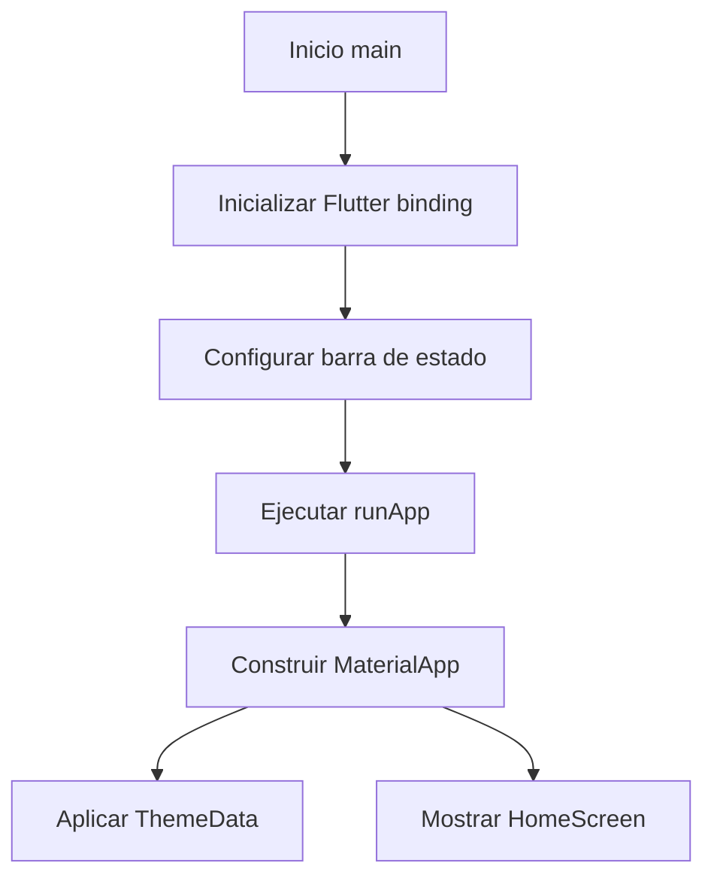
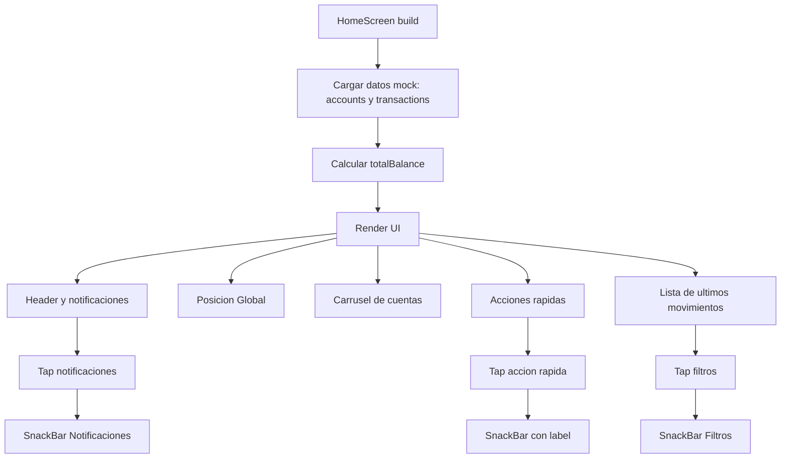
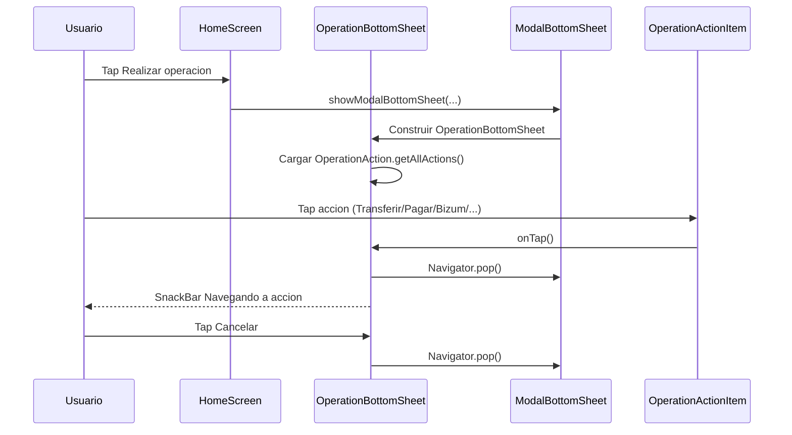
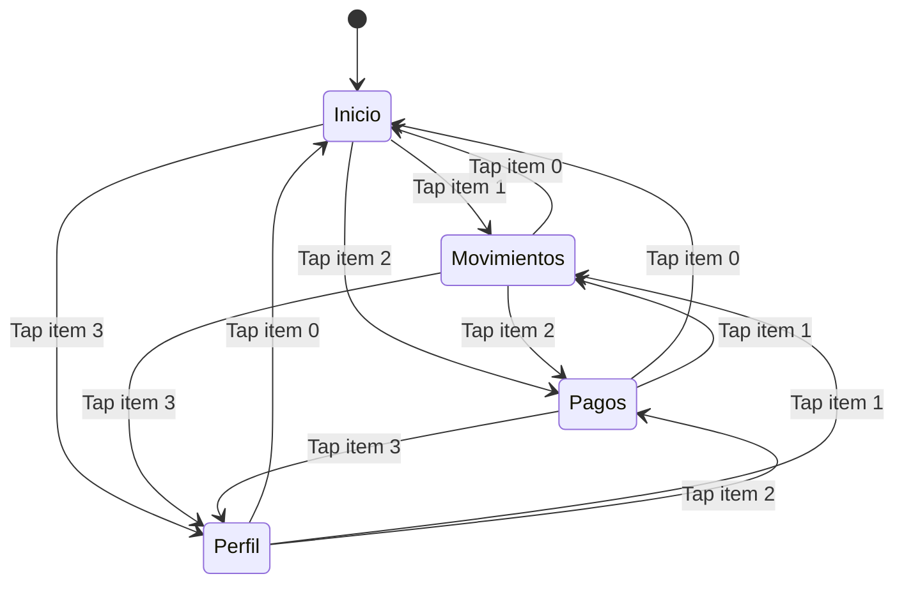

# Diagramas de flujos principales - GlobalFin

Este documento reúne los flujos más importantes de la aplicación para facilitar su comprensión funcional y técnica.

## 1) Arranque de la aplicación

## 2) Flujo principal de Home

## 3) Flujo de "Realizar operación" (Bottom Sheet)

## 4) Estados de navegación inferior

