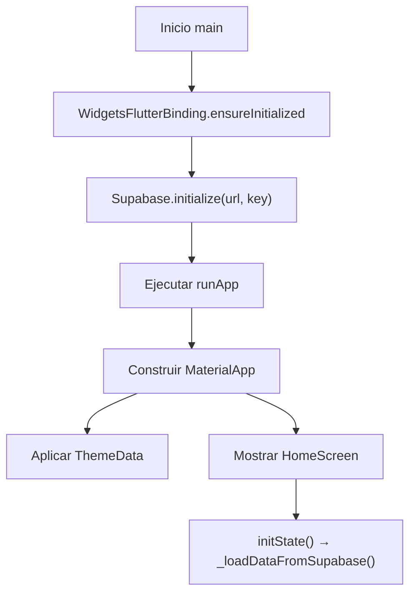
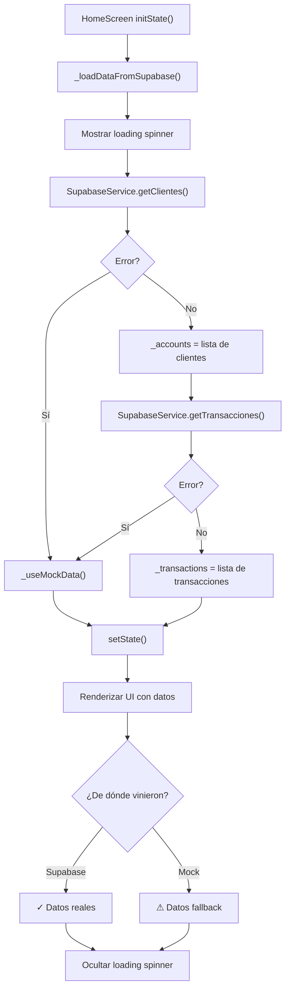
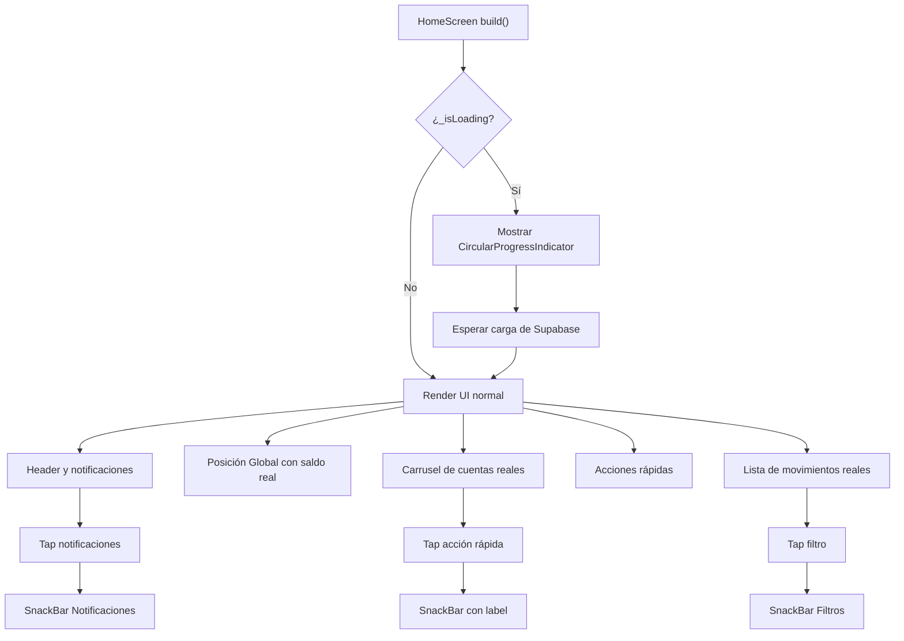
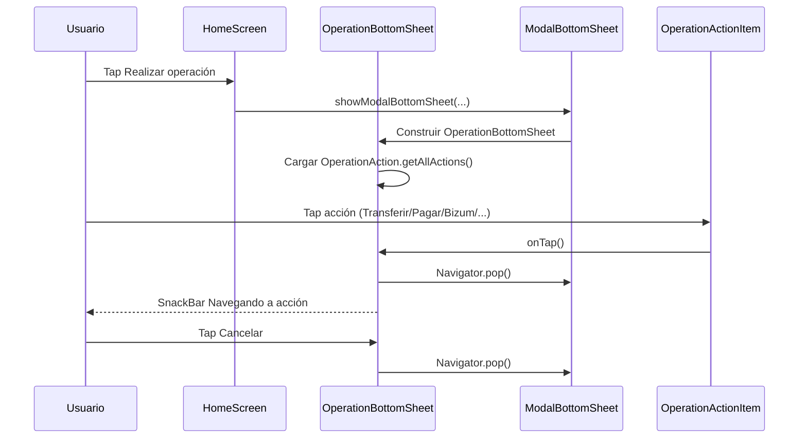
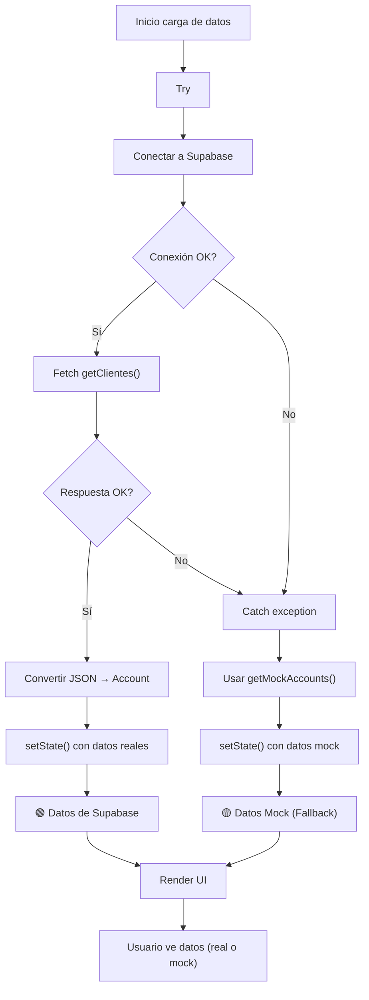
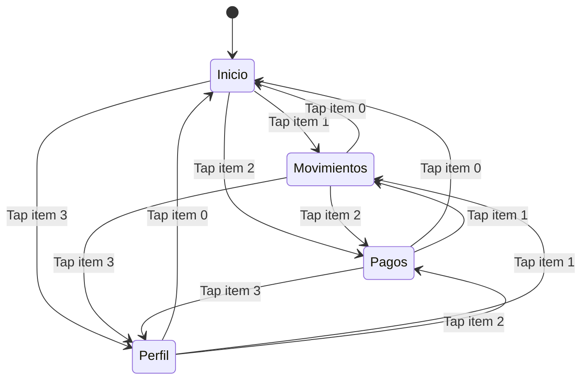
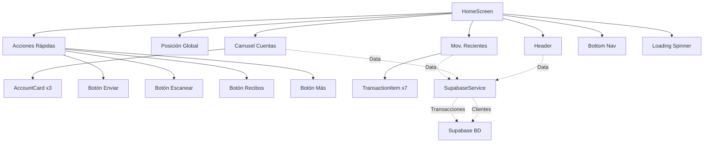
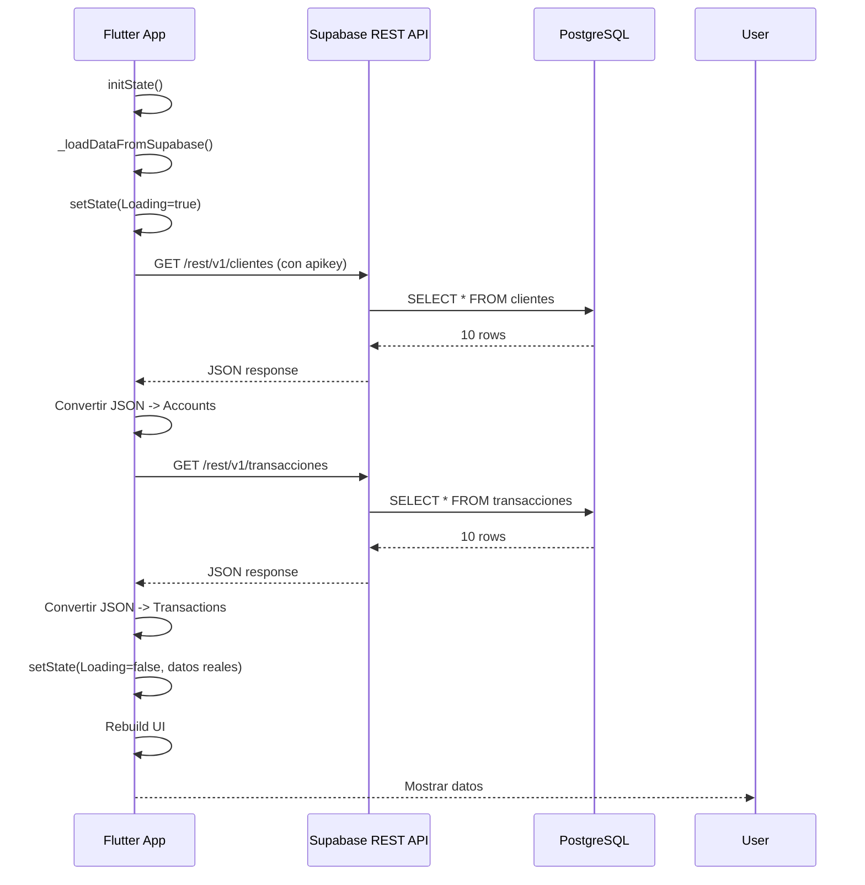

# Diagramas de flujos principales - GlobalFin

Este documento reúne los flujos más importantes de la aplicación para facilitar su comprensión funcional y técnica.

## 1) Arranque de la aplicación (CON SUPABASE)

## 2) Flujo de Carga de Datos (NUEVO - Supabase)

## 3) Flujo principal de Home (CON DATOS DINÁMICOS)

## 4) Flujo de "Realizar operación" (Bottom Sheet)

## 5) Flujo Híbrido: Supabase con Fallback (NUEVO)

## 6) Estados de navegación inferior

## 7) Componentes de HomeScreen (ARQUITECTURA)

## 8) Flujo de Sincronización (DETALLADO)

---

## 📋 Referencias Rápidas

- **Diagrama 1:** Cómo inicia la app con Supabase
- **Diagrama 2:** Flujo de carga de datos (lo más importante)
- **Diagrama 3:** Renderizado de UI con datos cargados
- **Diagrama 4:** Modal de operaciones (interactividad)
- **Diagrama 5:** Patrón try-catch-fallback (resiliencia)
- **Diagrama 6:** Estados del bottom nav (navegación)
- **Diagrama 7:** Estructura de componentes (arquitectura)
- **Diagrama 8:** Sincronización detallada (técnica)

---

**Última actualización:** 28 de Febrero, 2026  
**Estado:** ✅ Actualizado con Supabase Integration
